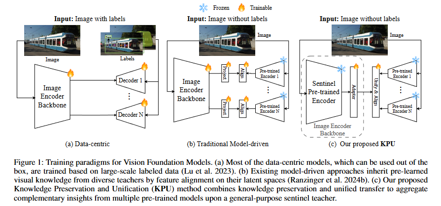
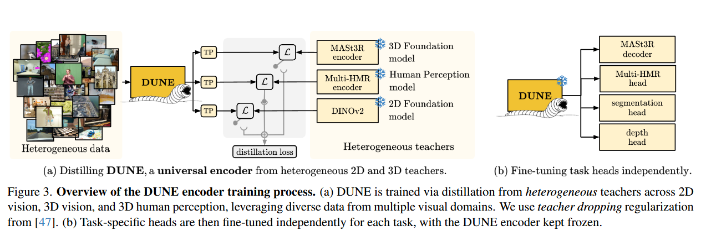

# Notes

---

Seeing Further on the Shoulders of Giants: Knowledge Inheritance for Vision Foundation Models

- mutiple teacher distillation

- project feature of teacher into a unified space to be aligned with feature of students.
  避免导致student倾向于学习feature magnitude更大的teacher
- freeze sentinel pre-trained encoder(dino v2) and train the adapter for specific knowledge.

---

DUNE: Distilling a Universal Encoder from Heterogeneous 2D and 3D Teachers

- heterogeneous teachers
- transformer projector instead of MLP
- full data sharing works the best (except for semantic segmentation)
- discard transformer projectors during inference

---

