# Notes

---

Seeing Further on the Shoulders of Giants: Knowledge Inheritance for Vision Foundation Models

- mutiple teacher distillation

- project feature of teacher into a unified space to be aligned with feature of students.
  避免导致student倾向于学习feature magnitude更大的teacher
- freeze sentinel pre-trained encoder(dino v2) and train the adapter for specific knowledge.

---

DUNE: Distilling a Universal Encoder from Heterogeneous 2D and 3D Teachers

- heterogeneous teachers

- transformer projector instead of MLP

  为了提取和其他patch之间的关系

- full data sharing works the best (except for semantic segmentation)

- discard transformer projectors during inference

---

[DTO-KD: DYNAMIC TRADE-OFF OPTIMIZATION FOR EFFECTIVE KNOWLEDGE DISTILLATION (ICLR'2026)](https://gemini.google.com/share/95bbe6deed6a)

challenges:

1. the trade-off between optimizing for the primary task loss and mimicking the teacher’s outputs.
2. the gradient disparity arising from architectural and representational mismatches between teacher and student models.

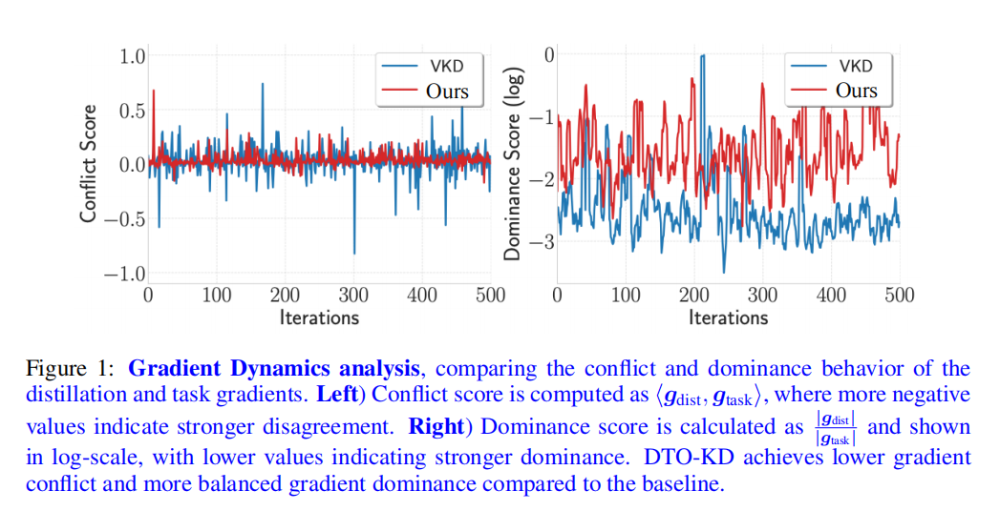

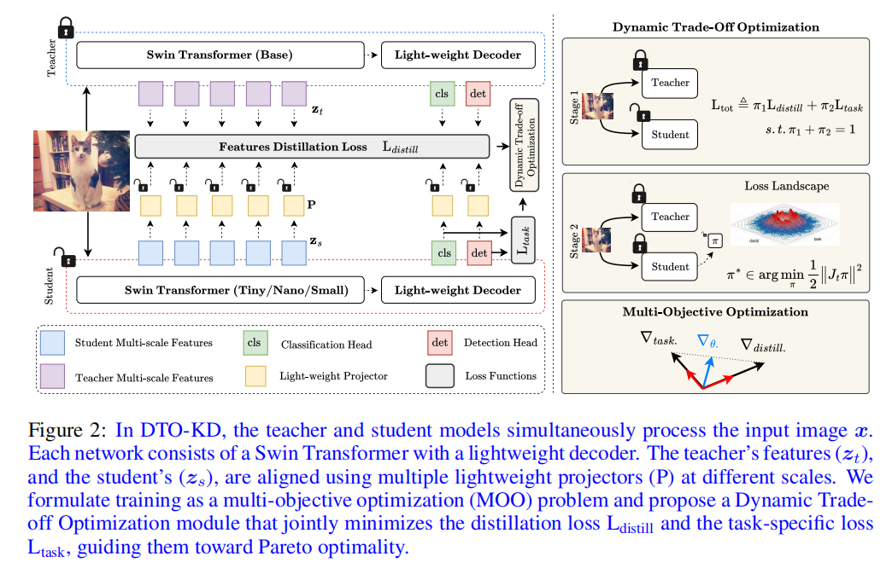

- multi-teacher, two in this paper

- method : MGDA
  和AMMKD方法差不多(?

- corollary 1 : g*的方向和g1、g2的方向对齐（有正分量）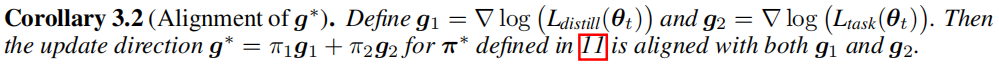

  corollary 2 : 沿g1、g2的正分量大小相等
  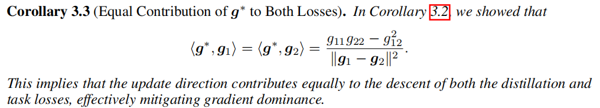

- corollary 3 : g*有下界，保证了训练的高效
  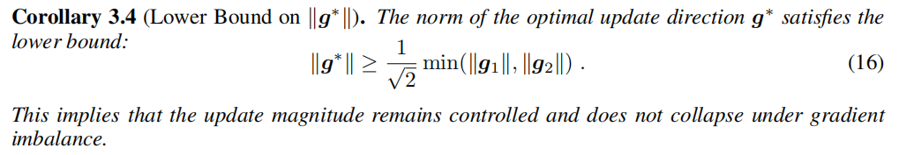

- corollary 4 : g*有上界，保证了训练的稳定性
  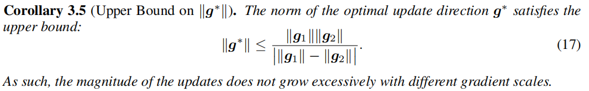

- g1,g2需要两次反向传播，效率低。论文提出近似算法以提高效率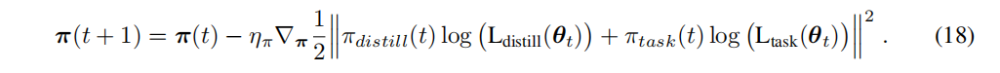

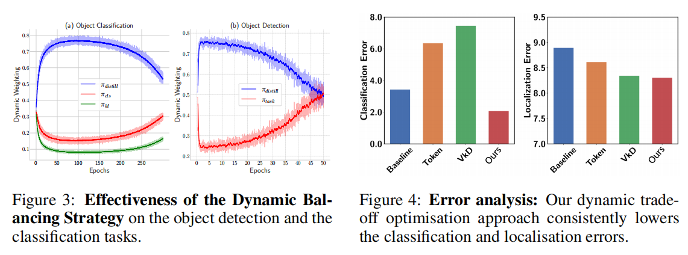

在分类和目标检测上均达**SOTA**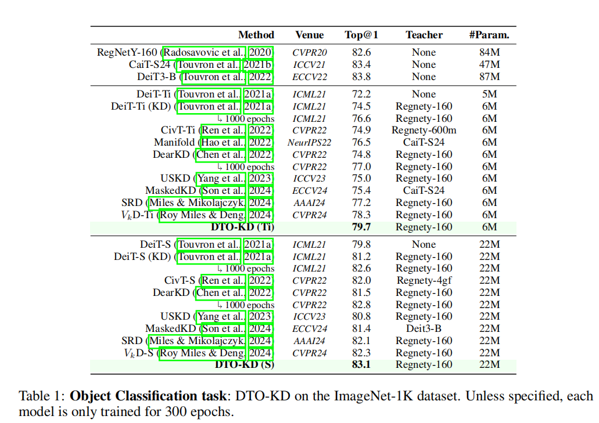
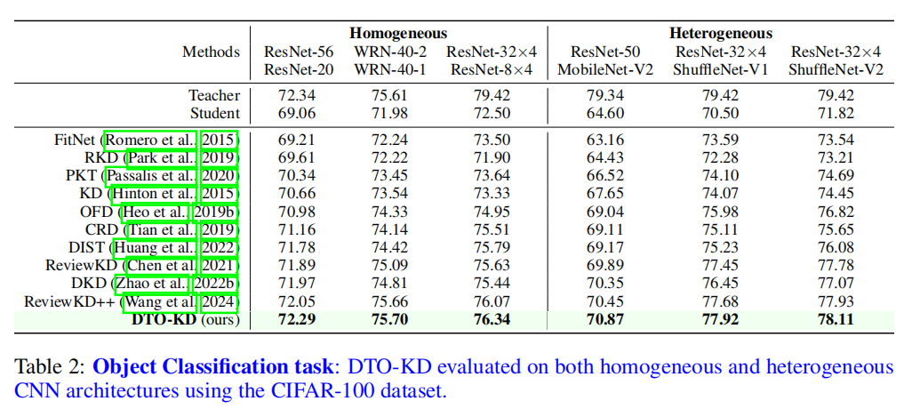
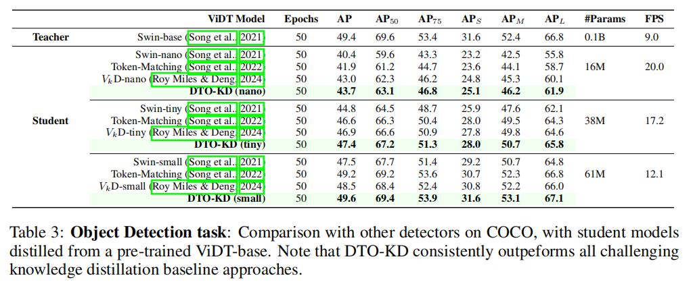

---

[EXPLORING KNOWLEDGE PURIFICATION IN MULTI-TEACHER KNOWLEDGE DISTILLATION FOR LLMS (ICLR' 2026)](https://gemini.google.com/share/a6c28ceaa2dd)

- LLM、multi-teacher

- challenge: knowledge conflict from multi teachers

- method:

  - knowledge aggregation（效率最低）
    聚合器(通常是强大的LLM，如GPT4)，将所有teacher的理由聚合成一个连贯的理由rp

    - LLM routing(效率最高)
      - Plackett-Luce Ranking
      - PLM Classifier
      - Similarity-based Router（**效果最好**）
    - RL-based Teacher Selection（**效果最好**，但迁移性差）

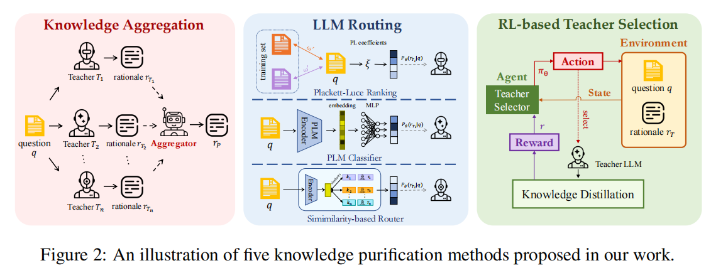

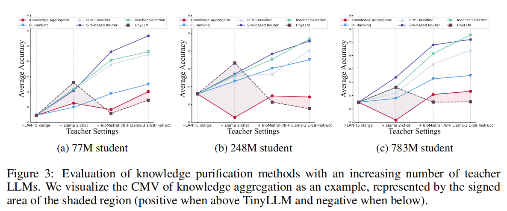

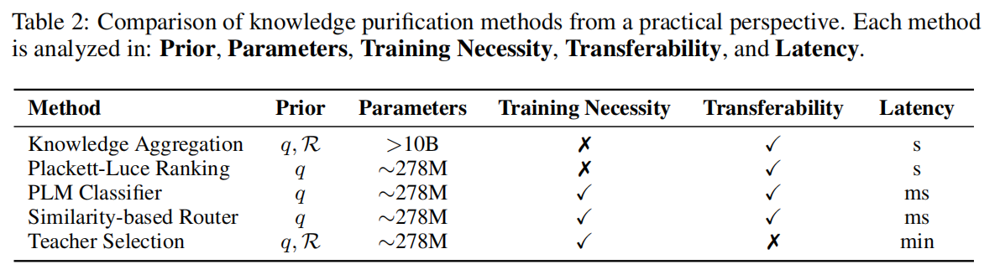

