# linear attention

---

## [Transformers are RNNs: Fast Autoregressive Transformers with Linear Attention](https://gemini.google.com/share/c285dcf8588c)

- challenge：transformer架构传统attentionO($N^2$)的时间复杂度

- method：linear attention，传统attention实际上就是一个指数核衡量相似度，对应的映射将低维数据映射到无限维空间，而linear attention将核函数写成两个有限维($N > D^2$)的映射，并采用矩阵的结合律避免冗余计算
  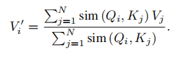

  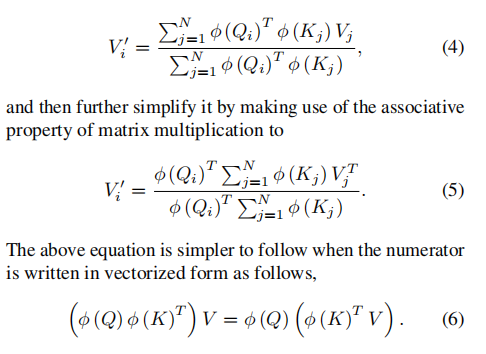

  加入因果掩码：

  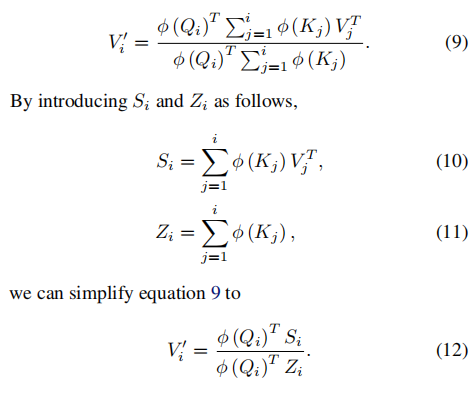

- benefit：When it comes to training, the computations can be parallelized and take full advantage of GPUs or other
  accelerators. When it comes to inference, the cost per time and memory for one prediction is constant for our model.
  This means we can simply store the φ (Kj ) VjT matrix as an internal state and update it at every time step like a
  recurrentneural network.

---

## RETHINKING ATTENTION WITH PERFORMERS

---

## EfficientViT: Multi-Scale Linear Attention for High-Resolution Dense Prediction

- 解决高精度输入下密集预测的低效问题

- global receptive field and multi-scale learning（two desirable features for high-resolution dense prediction）

- efficient global attention：ReLU attention

- efficient multi-scale learning：fusing DWConvs into a single DWConv and combining all 1\*1 Convs into a single 1\*1 group Conv
  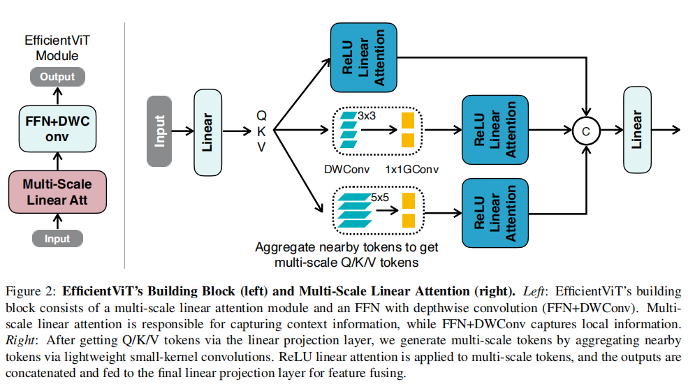

  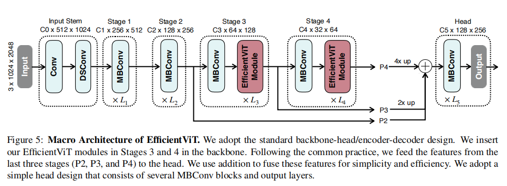

---

## [FLatten Transformer: Vision Transformer using Focused Linear Attention](https://gemini.google.com/share/29a05d10af14)

- 解决的问题
  - linear attention（ReLU attention） focus ability不足，即attention map过于平滑
    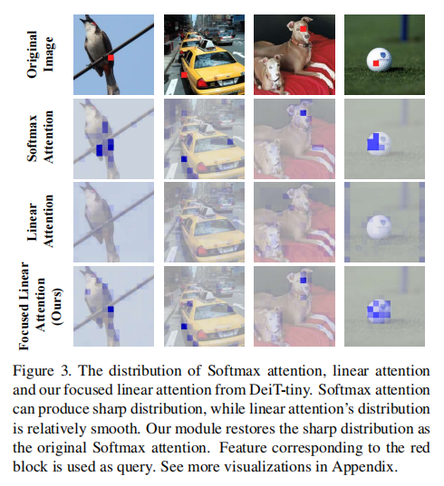
  - 使用linear attention（ReLU attention）导致的feature diversity不足，即Attention Matrix的秩过低（i.e $rank(Attention Matrix)<=min(N,d)$）
    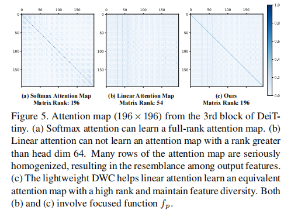
- 针对focus ability：
  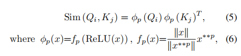
  fp只改变向量的方向，将方向向最靠近的轴偏移
  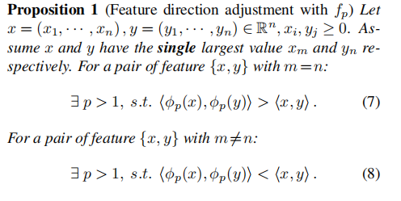
- 针对feature diversity：
  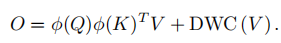
  加入深度卷积，深度卷积对应的矩阵可以是满秩的，提高了$upperBound(rank(Attention Matrix))$

---

## Hydra Attention: Efficient Attention with Many Heads

- linear attention的精度受注意力头数的影响较小，而MLA(muti-head linear attention)的时间复杂度为$O(TD^2/H)$，
  则将H设置为D可以最大地减小计算复杂度为$O(TD)$
  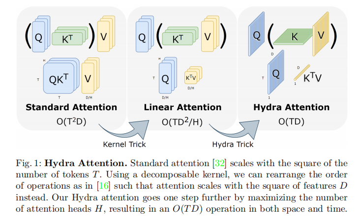

  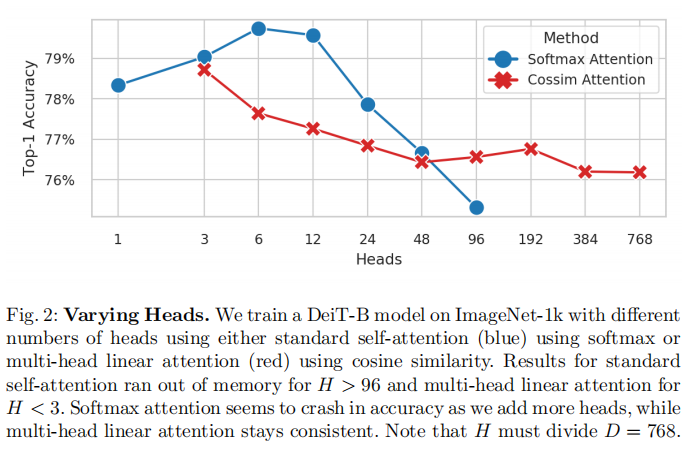

- kernel function的选择：
  This might be because cosine similarity changes the nature of attention. With MSA (Eq. 5), attention exclusively mixes information contained in V , as the mixing weights sim(Q, K) must sum to 1. That’s not the case when using cosine similarity or other unrestricted dot-product kernels like mean. And it turns out, these weights summing to 1 might not be a desirable property in the first place.

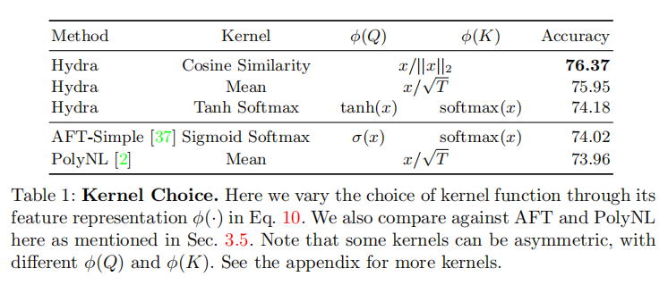

- 可视化attention：由于每个头的维度只有一维，将attention map直接求和平均会得到无意义的噪声图，因此作者将predicted class对应的logits作为loss function，对最后一层attention layer的cls token求梯度，计算每一个patch token在该梯度g上的分量
  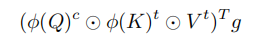
- hydra attention应该替换哪些层：从后往前替换和交替替换更优，因为hydra attention学到的是每一个token和global feature之间的关系
  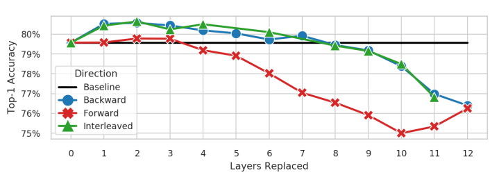

---

## [mamba](https://blog.csdn.net/v_JULY_v/article/details/134923301)

https://gemini.google.com/share/8d0ff3a382cc

---

## [Vision Mamba: Efficient Visual Representation Learning with Bidirectional State Space Model](https://gemini.google.com/share/6c49bc95716b)

- mamba模型适用于对因果关系建模，处理输入图片时，同一个图片内没有因果关系，因此vision mamba选择采用forward pass和backward pass两条路径

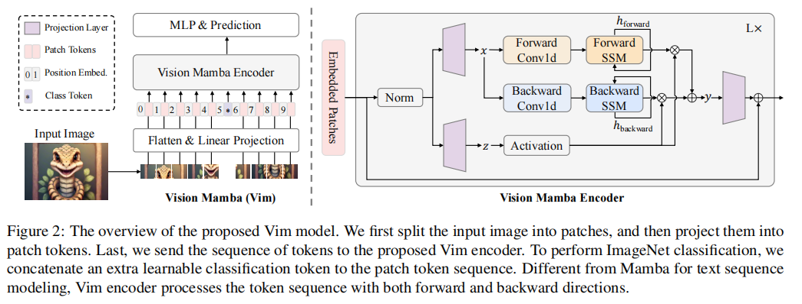

---

## [Demystify Mamba in Vision: A Linear Attention Perspective](https://gemini.google.com/share/c2fe208a97c2)

- 将mamba和linear attention表达式统一成相同的形式，通过比较其不同，确定是mamba的哪个机制带来了性能提升，并将其应用到linear attention中
  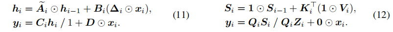
- 输入门$\Delta_i$，slightly helpful，因为$\Delta_i$只考虑当前token，而没有考虑全局的语义信息
  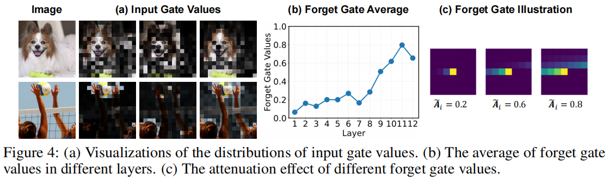
- 遗忘门$\tilde{A}_i$，obvious performance improvement，但是因为引入遗忘门导致无法高效并行计算，尽管使用了mamba的硬件感知的高效算法，但吞吐依然下降严重，分析$\tilde{A}_i$的值发现，遗忘门起到的作用是局部偏置和位置信息，因此可以使用位置编码替代
  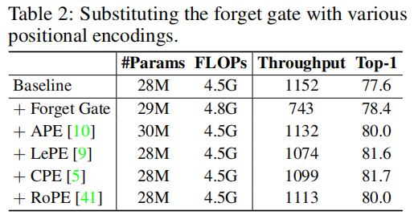
- 捷径连接  $D\odot x_i$，可有可无，带来了 0.2 的精度微升，但吞吐量也有所下降（1152 降至 1066）
- 注意力归一化，去掉线性注意力的归一化（分母 $Q_i Z_i$），模型精度会从 77.6 发生雪崩式下降，跌至 72.4，深层网络中个别长度较大的 token 会完全主导整个特征图
  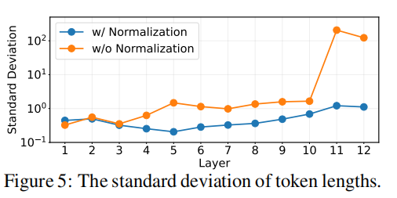
- 是否是多头注意力，改为单头，精度会骤降至 73.5 
- vit和mamba宏观架构不同，用 Mamba 的块设计（融合了深度卷积、门控等）替换原本的注意力子块，精度直接拉升至 80.9

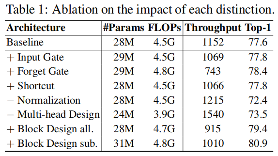

- 综合以上分析，作者设计出MILA(Mamba Inspired Linear Attention)

  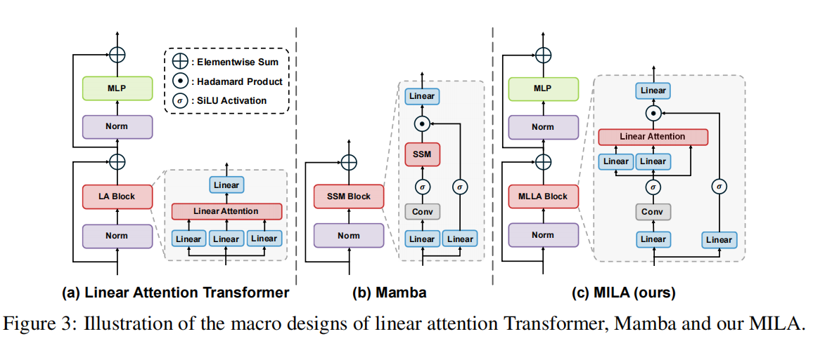

---

## [SoLA-Vision: Fine-grained Layer-wise Linear Softmax Hybrid Attention](https://gemini.google.com/share/cb8c53b2d458)

- linear attention虽然是O(N)复杂度，但是表达能力明显弱于softmax attention

- 分析：
  早期的linear attention：
  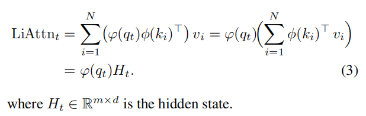
  一些现代linear attention：
  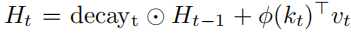
  展开之后，可以发现隐含的距离依赖
  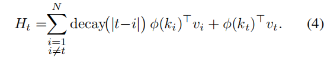
  以指数衰减的核为例：
  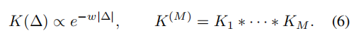
  应用中心极限定理：

  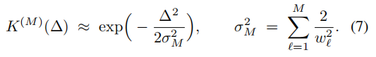
  推出感受野随层数的1/2次方提升

  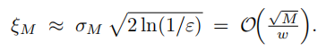
  分辨率较高时linear attention对四角的猫头鹰attention受到距离衰减的影响
  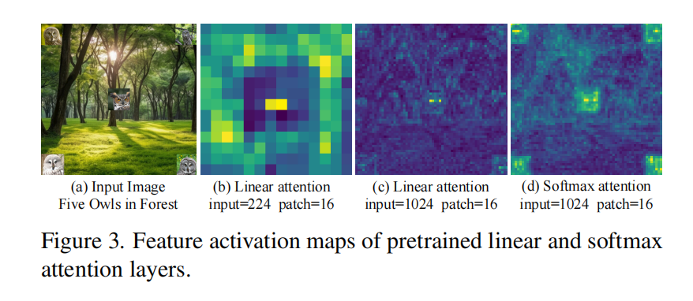

- method：
  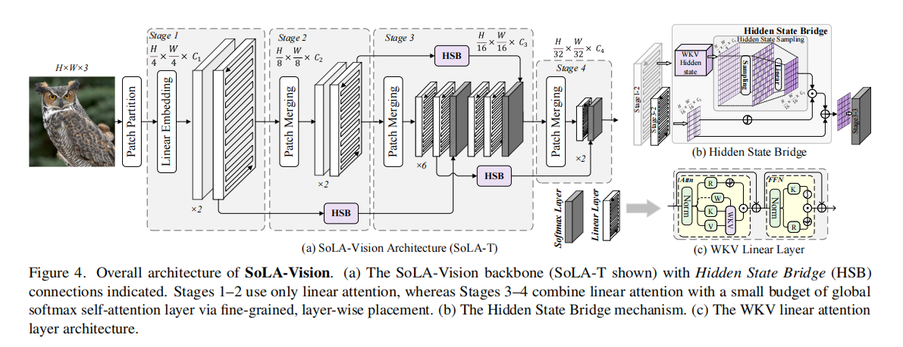

  - 早期分辨率太高，global attention(softmax attention)太昂贵，因此选择在stage3、4插入global attention
    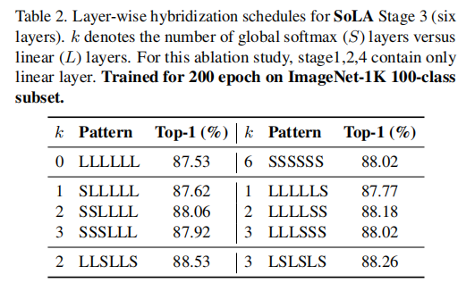
  - HSB为了弥补在早期缺失的全局交互，将早期low level的特征注入到stage3中

- 实验结果：
  classification：
  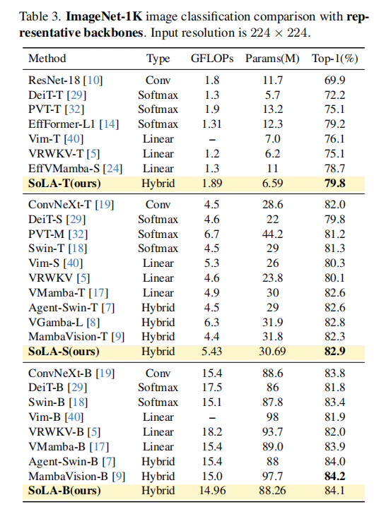
  object detection：
  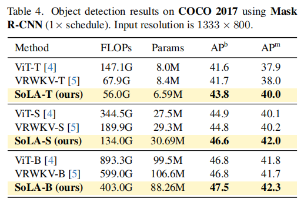
  semantic segmentation：
  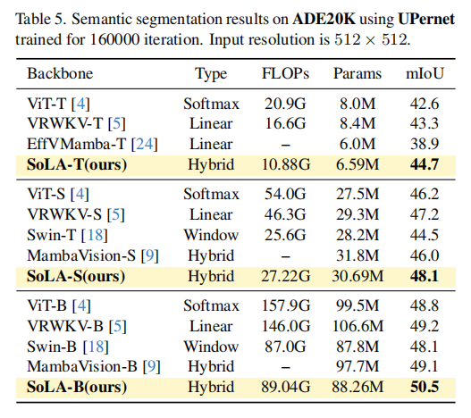
  visualization(EigenCAM)：

  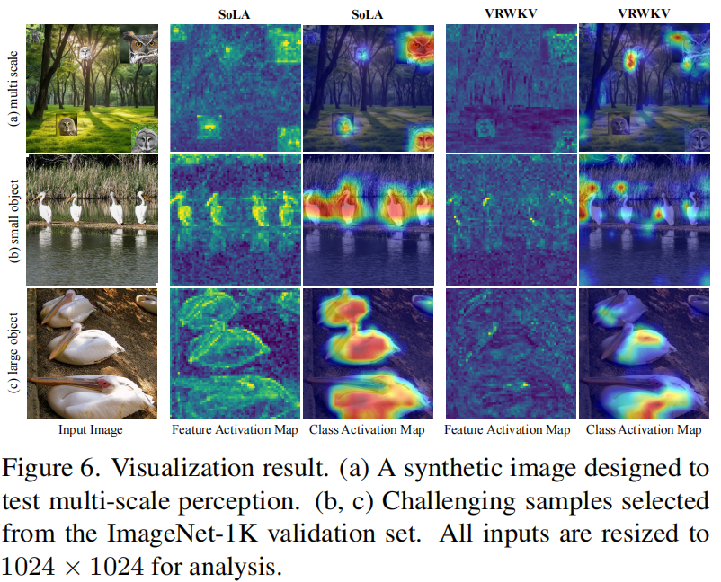