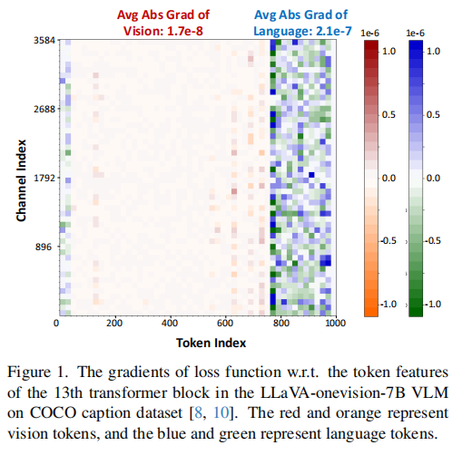
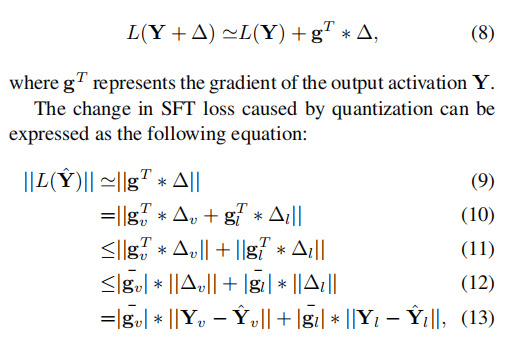
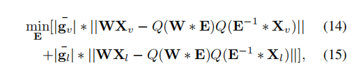
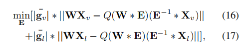
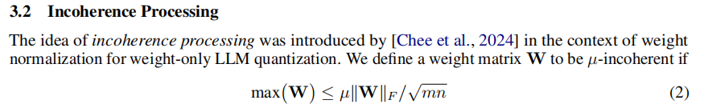
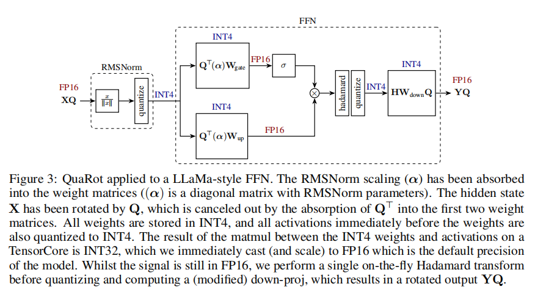

# Model Quantization

---

## MBQ: Modality-Balanced Quantization for Large Vision-Language Models

- mllm quantization
- insight: loss function对vision token和text token的梯度相差很大
- 通过梯度为优化目标加权

- prefill 阶段：computation bound，既量化权重又量化激活
- decoding 阶段：memory access bound, 仅量化权重

---

## [QuaRot: Outlier-Free 4-Bit Inference in Rotated LLMs](https://gemini.google.com/share/e4ddfec06651)

- LLM quantization

- motivation: 权重和激活(especially)中的离群值影响了模型量化

- 定义不相干性：

- 通过特殊的正交矩阵——Hadamard Matrix减小不相干性，Hadamard Matrix计算效率高

-  stage 1a: weight modification

  

- stage 1b: rotate FFN activations

- stage 1c: attention value projection

- stage 1d: key rotation
  Pre-RoPE caching VS Post-RoPE caching
  前者将key经过变换之后rope之前放入cache，后者将key经过rope之后再变换之后放入cache
  论文选择后者，因为decoding只需要当前一个query，使用前者导致每个key都要反变换再加rope，而后者只要对当前query进行rope之后再变换即可

- stage 2a: Weight Quantization

- stage 2b: Online Quantization Operations

- stage 2c: Quantized Attention